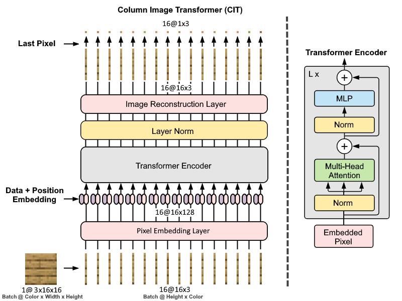

# Masterthesis

### Texture Asset Generation through Transformer Models

# Abstract

This thesis explores the adaptation of Transformer architectures, traditionally used in natural language processing, for generating texture assets in digital environments, such as video games. The primary focus is on developing and evaluating two novel models: the Column Image Transformer (CIT) and the Spiral Image Transformer (SIT). Both models aim to generate texture assets from seed images, photos, or drawings.

The CIT model processes images by segmenting them into vertical columns and predicts subsequent pixels within a column using the context provided by previous pixels. In contrast, the SIT model analyzes pixels in a spiral pattern to capture a broader context within the image, which can be important for generating complex textures. These models were trained on a high-performance computing system, utilizing a dataset consisting of various game textures.

Experimental results indicate that both models have a basic understanding of the colors, positions, and space of texture assets. With further work, such as using a larger dataset and scaling up the models, high-quality images could be generated and produced. Additionally, future work could explore the integration of text descriptions to guide texture generation, potentially enhancing the model's utility in real-world applications.

# Column Image Transformer (CIT)

The Column Image Transformer (CIT) is the first transformer-based model approach in this thesis. It processes input data in a columnar format.

# Spiral Image Transformer (SIT)

The Spiral Image Transformer, as implied by its name, is a transformer-based model specifically designed to process image data by unrolling pixels in a spiral pattern. This approach stands in contrast to the CIT Model, which processes data using a column-by-column method.

## Masterthesis PDF

https://github.com/DennisGoss99/MasterThesis/blob/main/masterthesis.pdf